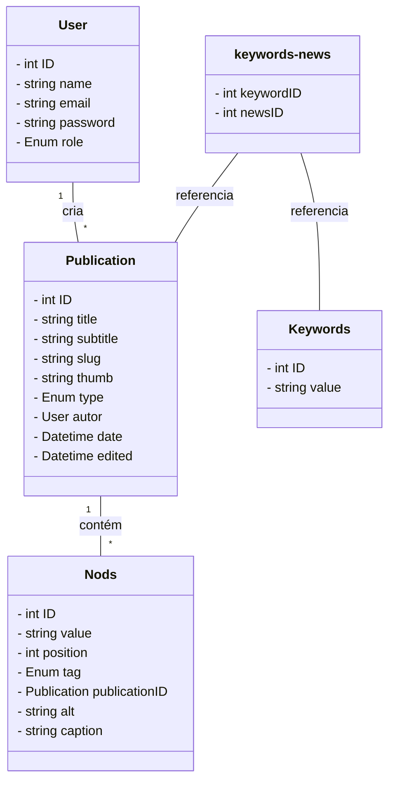

# 🎸 HANGAR 18 

## ♫ Apresentação 

Nomeado com inspiração em uma música de mesmo nome do "Megadeth", **Hanagr 18** é um projeto pessoal de um portal de notícias voltadas para o cenário do rock. 

O site tem como objetivo principal construir uma plataforma que seja um ponto de referência para a comunidade do  rock na internet e amplie a divulgação de conteúdos relacionados, voltados principamente às músicas underground e nacional. 

Embora tenha na sua essência uma temática nichada, a sua estrutura possue os mesmo requisitos comuns de  um site de notícias, como *publicar uma matéria*, *editar suas informações* e *salvar o conteúdo em um servidor*, o que permite adaptar o projeto para diferentes contextos.

## 🛠️ Funcionalidades

### 📝 Sistema Completo de Publicação (CRUD)

A aplicação oferece uma interface gráfica intuitiva para o ciclo completo de gerenciamento de artigos:

✍️ Criação de novos artigos 
   
🔧 Edição de conteúdo já publicado

👁️ Visualização em tempo real

🗑️ Exclusão controlada de publicações

Todos os artigos são armazenados e gerenciados diretamente no servidor do projeto.

### 👥 Sistema Hierárquico de Usuários

Para garantir segurança e organização, implementamos um sistema de permissões por cargos

| Cargo | Permissões | Descrição |
|-------|------------|-----------|
| **Autor** |  Criar artigos | Responsável pela produção de conteúdo |
| **Editor** |  Editar artigos | Revisa e aprimora publicações existentes |
| **Administrador** |  Editar +  Excluir +  Gerenciar usuários | Controle total do sistema |

⚠️ Importante: Leitores do site têm acesso público apenas à leitura. Todas as páginas de administração são protegidas e requerem autenticação.

### 🔍 Sistema Inteligente de Busca

Cada artigo inclui um sistema de palavras-chave (keywords) cadastradas pelo autor para os usuários finais  buscarem na página artigos relacionados à uma temática específica.

Exemplo de uso: Um artigo sobre "Megadeth" pode ter keywords como: thrash metal, Dave Mustaine, heavy metal, anos 80 - facilitando que fãs encontrem conteúdo relevante.

## 💾 Banco de Dados

Segue abaixo o diagrama do banco de dados usado na aplicação.

`User` - tabela com os usuários cadastrados

`Publications` - tabela com as informações gerais de uma publicação 

`Nods` - cada tupla da tabela representa o elemento do conteúdo de uma publicação, como parágrafo e imagem

`Keywords` - tabela com os valores chaves para a busca 

`keywords-news` - assosiação entre keywords e referentes à uma publicação 

## 🔴 Pré-requisitos
